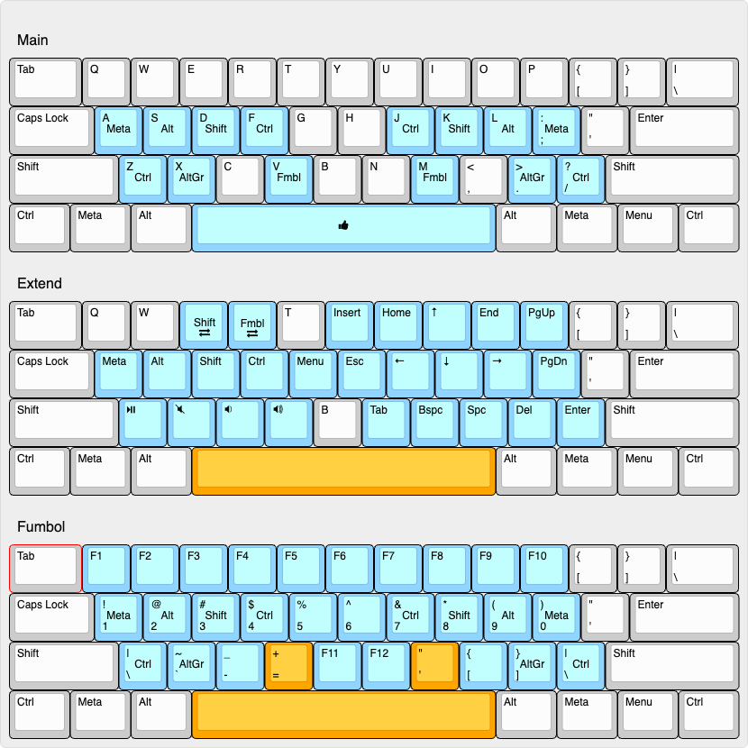
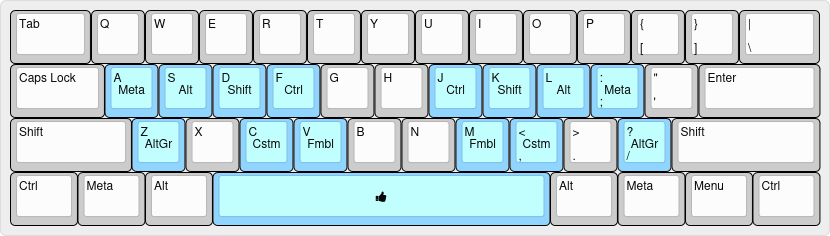
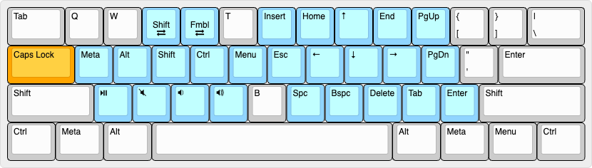
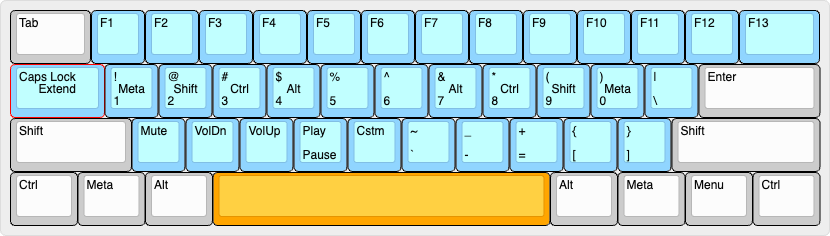

  

# Kenkyo

A layered keyboard layout designed to augment your productivity without altering your keyboard's default behavior. Master touch-typing and ergonomic key combinations while keeping your hands centered.

> [!TIP]
> **Kenkyo (謙虚)** is the Japanese term for humility or modesty, reflecting the layout's philosophy of staying out of your way until needed.

## Key Benefits

- **Hardware Agnostic:** Works on any keyboard via software (Kanata or Keyd).
- **Minimalist:** Requires only 31 keys to access 100% of a standard keyboard's functionality.
- **Ergonomic:** Reduces hand movement and strain by keeping everything under your home row.
- **Seamless Learning:** Designed to be used gradually; your default layout remains fully functional.

## Getting Started

To use Kenkyo, install your preferred keyboard customization software and use the provided configuration files.

### 1. Choose your Software

| Software | Platform | Repository |
| :--- | :--- | :--- |
| **Kanata** | Windows, Linux, macOS | [jtroo/kanata](https://github.com/jtroo/kanata) |
| **Keyd** | Linux | [rvaiya/keyd](https://github.com/rvaiya/keyd) |

### 2. Installation

1. Clone this repository or download the configuration for your chosen software.
2. Place the configuration files in the recommended directory for the software:
   - **Kanata:** Typically `~/.config/kanata/` or specified via command line.
   - **Keyd:** Copy `keyd/default.conf` to `/etc/keyd/default.conf`.

## Layout Overview

Kenkyo uses a layered approach, where the "Main" layer handles standard typing, and additional layers are activated via modifiers or specific keys.

### Core Chords

Available on most layers for quick access to essential keys:

- `W` + `E` → **Esc**
- `I` + `O` → **BackSpace**
- `X` + `C` → **Tab**
- `,` + `.` → **Enter**

### Layers

#### Main Layer
The base layer featuring **Home Row Modifiers**. Hold keys on the home row to activate `Meta`, `Alt`, `Shift`, or `Ctrl`.

- **Left Hand:** `A` (Meta), `S` (Alt), `D` (Shift), `F` (Ctrl)
- **Right Hand:** `J` (Ctrl), `K` (Shift), `L` (Alt), `;` (Meta)

#### Extend Layer
Activated by holding **Space**. This layer puts navigation and editing tools directly under your right hand.

- **Navigation:** Arrow keys, Home/End, PgUp/PgDn.
- **Editing:** Backspace, Delete, Enter, Tab.
- **Media:** Volume controls and Play/Pause on the left hand.

#### Fumbol Layer
Designed for numbers, function keys, and symbols. Access it by holding `V` or `M`, or via the Extend layer.

- **Numbers:** Distributed along the home row.
- **Function Keys:** `F1`–`F10` on the top row, `F11`–`F12` on the bottom.
- **Math Chords:** Quick access to `-`, `+`, `=`, `/`, `*` via home row combinations.

## Philosophy

Kenkyo is built on four core principles:

1. **Seamlessness:** The layout is invisible until you choose to use its features.
2. **Progressiveness:** Adopt patterns at your own pace without breaking your workflow.
3. **Composability:** Uses standard patterns like [Home Row Modifiers](https://precondition.github.io/home-row-mods) and [SpaceFn](https://drop.com/talk/138510/what-is-space-fn-and-why-you-should-give-it-a-try).
4. **Efficiency:** Strikes a balance between minimal hand motion and ease of learning.

---

> [!NOTE]
> This layout assumes a physical QWERTY keyboard but is independent of your system's language settings.
