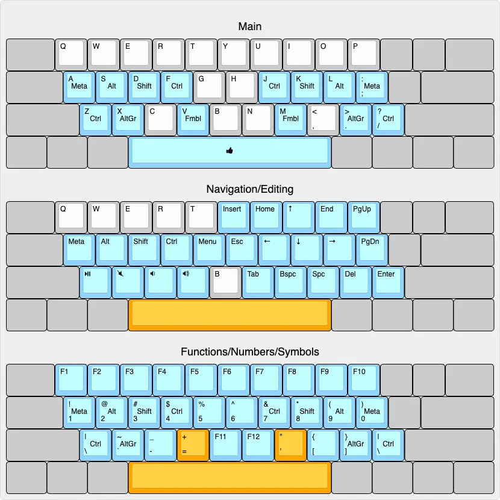
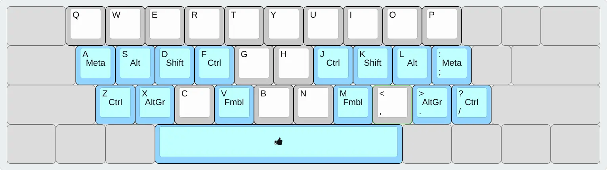
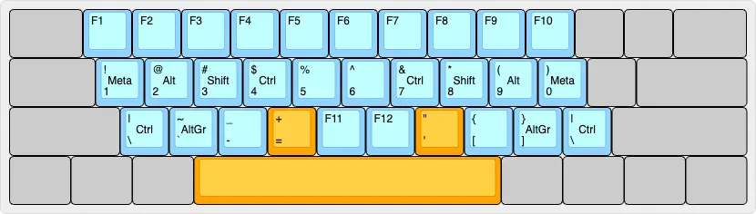
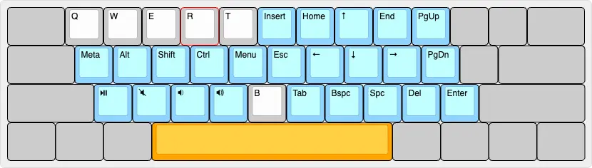

<p align="center">
  
</p>

<h1 align="center">Kenkyo</h1>

<p align="center">
  <strong>A minimal, ergonomic, and hardware-agnostic 31-key layered keyboard layout.</strong>
</p>

<p align="center">
  <a href="#license"></a>
  <a href="https://github.com/jtroo/kanata"></a>
  <a href="https://github.com/rvaiya/keyd"></a>
</p>

---

**Kenkyo (謙虚)** is the Japanese term for *humility* or *modesty*. True to its name, Kenkyo stays completely out of your way: your standard keyboard layout remains fully functional while providing access to 100% of standard keyboard capabilities using only 31 keys.

## Table of Contents

- [Key Benefits](#key-benefits)
- [Repository Structure](#repository-structure)
- [Getting Started & Installation](#getting-started--installation)
  - [Kanata (Cross-platform)](#kanata-cross-platform)
  - [Keyd (Linux)](#keyd-linux)
  - [Keydo (Cross-platform)](#keydo-cross-platform)
- [Layout Overview & Learning Path](#layout-overview--learning-path)
  - [1. One-Key Chords](#1-one-key-chords)
  - [2. Home and Bottom Row Modifiers](#2-home-and-bottom-row-modifiers)
  - [3. One-Shot Single Modifiers](#3-one-shot-single-modifiers)
  - [4. Space-Anchored Modifiers](#4-space-anchored-modifiers)
  - [5. One-Shot Multi-Modifiers](#5-one-shot-multi-modifiers)
  - [6. Fumbol Layer](#6-fumbol-layer)
  - [7. SpaceFN and the Extend Layer](#7-spacefn-and-the-extend-layer)
- [Design Philosophy](#design-philosophy)
- [Contributing](#contributing)
- [License](#license)

---

## Key Benefits

- ⌨️ **Hardware Agnostic:** Runs purely in software via [Kanata](https://github.com/jtroo/kanata), [Keyd](https://github.com/rvaiya/keyd), or [Keydo](https://github.com/argenkiwi/keydo). Works on standard laptop keyboards and full-size layouts.
- 🎯 **Minimalist:** Requires only 31 keys to access 100% of full-sized keyboard functionality.
- 🖐️ **Ergonomic:** Eliminates wrist reaching and finger stretching by keeping navigation, symbols, and modifiers directly under your home row.
- 🪜 **Progressive Learning:** Adopt features gradually at your own pace without disrupting your existing typing habits.

---

## Repository Structure

```text
.
├── kanata/
│   └── kanata.kbd    # Configuration file for Kanata (Windows, macOS, Linux)
├── keyd/
│   └── default.conf  # Configuration file for Keyd (Linux)
├── images/           # Visual layer maps and graphic assets
├── LICENSE           # MIT License
└── README.md
```

---

## Getting Started & Installation

Choose your preferred keyboard remapping engine below to install and load Kenkyo.

| Engine | Platform Support | Config File | Project Repository |
| :--- | :--- | :--- | :--- |
| **Kanata** | Windows, macOS, Linux | [`kanata/kanata.kbd`](file:///Users/leandro/Code/kenkyo/kanata/kanata.kbd) | [jtroo/kanata](https://github.com/jtroo/kanata) |
| **Keyd** | Linux | [`keyd/default.conf`](file:///Users/leandro/Code/kenkyo/keyd/default.conf) | [rvaiya/keyd](https://github.com/rvaiya/keyd) |
| **Keydo** | Windows, macOS, Linux | Config compatible | [argenkiwi/keydo](https://github.com/argenkiwi/keydo) |

### Kanata (Cross-platform)

1. Install [Kanata](https://github.com/jtroo/kanata#installation) for your operating system.
2. Run Kanata pointing to the configuration file in this repository:
   ```bash
   kanata -c kanata/kanata.kbd
   ```

### Keyd (Linux)

1. Install [Keyd](https://github.com/rvaiya/keyd#installation).
2. Copy the configuration file to `/etc/keyd/default.conf`:
   ```bash
   sudo cp keyd/default.conf /etc/keyd/default.conf
   sudo keyd reload
   ```

### Keydo (Cross-platform)

Follow installation instructions on the [Keydo repository](https://github.com/argenkiwi/keydo) and load the Kenkyo configuration.

---

## Layout Overview & Learning Path

Kenkyo uses a layered approach where the **Main** layer handles standard typing, and additional layers are activated via modifiers or specific key combinations. The layout is designed to be learned step-by-step in the following sequence:

### 1. One-Key Chords

Start with the essentials. These chords are available on most layers for quick access to keys that are otherwise far from your home row:

- `W` + `E` → **Esc**
- `I` + `O` → **Backspace**
- `X` + `C` → **Tab**
- `,` + `.` → **Enter**

### 2. Home and Bottom Row Modifiers

Hold keys on the home row or bottom row to activate standard system modifiers:

- **Home Row (Left Hand):** `A` (Meta/Super), `S` (Alt), `D` (Shift), `F` (Ctrl)
- **Home Row (Right Hand):** `J` (Ctrl), `K` (Shift), `L` (Alt), `;` (Meta/Super)
- **Bottom Row (Left Hand):** `Z` (Ctrl), `X` (AltGr / Right Alt)
- **Bottom Row (Right Hand):** `.` (AltGr / Right Alt), `/` (Ctrl)

<p align="center">
  
</p>

### 3. One-Shot Single Modifiers

Tap a modifier key together with `Space` to trigger a one-shot modifier for just the next keypress:

- `D` + `Space` (or `K` + `Space`) → **One-shot Shift**
- `X` + `Space` (or `.` + `Space`) → **One-shot AltGr**

### 4. Space-Anchored Modifiers

Extend one-shot behavior by anchoring with `Space`. Tap a modifier key together with `Space`, then **keep holding `Space`** after releasing the modifier key to keep that modifier active for multiple keypresses without needing to hold down the modifier key itself.

### 5. One-Shot Multi-Modifiers

Combine multiple modifier keys in a single chord together with `Space` for one-shot access to several modifiers at once:

- **Left Hand:** `X` + `D` (AltGr + Shift), `X` + `V` (AltGr + Fumbol), `D` + `V` (Shift + Fumbol), `X` + `D` + `V` (all three)
- **Right Hand:** `K` + `.` (AltGr + Shift), `M` + `.` (AltGr + Fumbol), `M` + `K` (Shift + Fumbol), `M` + `K` + `.` (all three)

### 6. Fumbol Layer

Access numbers, function keys, and math symbols via the **Fumbol** layer using hold, one-shot, or space-anchored triggers:

- **Activation:** Hold `V` (left) or `M` (right), or tap `V` + `Space` / `M` + `Space` for one-shot / anchored access.

<p align="center">
  
</p>

- **Numbers:** Distributed along the home row.
- **Function Keys:** `F1`–`F10` on the top row, `F11`–`F12` on the bottom row.
- **Math Chords:** Quick access to `-`, `+`, `=`, `/`, `*` via home row combinations.

### 7. SpaceFN and the Extend Layer

Hold **Space** to enter the **Extend** layer, placing navigation and editing tools directly under your fingers.

<p align="center">
  
</p>

- **Navigation:** Arrow keys, Home/End, Page Up/Page Down.
- **Editing:** Backspace, Delete, Enter, Tab.
- **Media:** Volume controls and Play/Pause on the left hand.

---

## Design Philosophy

Kenkyo is built on four core principles:

1. **Seamlessness:** The layout is invisible until you choose to use its features.
2. **Progressiveness:** Adopt patterns at your own pace without breaking your existing workflow.
3. **Composability:** Integrates standard ergonomic concepts such as [Home Row Modifiers](https://precondition.github.io/home-row-mods) and [SpaceFn](https://drop.com/talk/138510/what-is-space-fn-and-why-you-should-give-it-a-try).
4. **Efficiency:** Strikes a balance between minimal hand motion and ease of learning.

> [!NOTE]
> This layout assumes a physical QWERTY keyboard layout but is independent of your operating system's software language settings.

---

## Contributing

Contributions, issues, and feature requests are welcome! Feel free to check the issues or submit a pull request if you have ideas for layout enhancements or support for additional remapping software.

---

## License

Distributed under the MIT License. See [`LICENSE`](file:///Users/leandro/Code/kenkyo/LICENSE) for more details.

