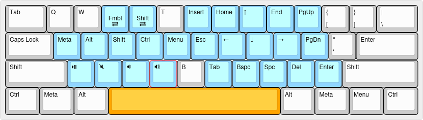
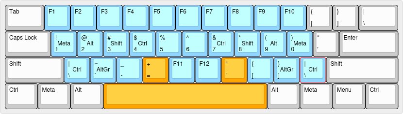

# Kenkyo

A layered keyboard layout designed to augment your keyboard's capabilities without altering or interfering with its default behaviour, so you can remain productive as you learn to use it.

> Kenkyo (謙虚) is the Japanese term for humility or modesty.

## Components

### Chords

This layout implements a few chords, also known as combos or key combinations, which are common to all layers with the exception of _Extend_:

- `W` + `E`: `Esc`
- `I` + `O`: `BackSpace`
- `X` + `C`: `Tab`
- `,` + `.`: `Enter`

### Layers

Blue keys represent changes to the default layer. Orange indicates the key being held to activate the current layer.

> Bear in mind that layer and modifier keys will activate only if another key is tapped immediately after. Otherwise, the expected repeat or long-press action will be respected (although a slight delay may be perceived).

#### [Main](https://www.keyboard-layout-editor.com/##@_name=Main;&@_w:1.5;&=Tab&=Q&=W&=E&=R&=T&=Y&=U&=I&=O&=P&=%7B%0A%5B&=%7D%0A%5D&_w:1.5;&=%7C%0A%5C;&@_w:1.75;&=Caps%20Lock&_c=#90D5FF;&=A%0A%0A%0A%0A%0A%0A%0A%0A%0AMeta&=S%0A%0A%0A%0A%0A%0A%0A%0A%0AAlt&=D%0A%0A%0A%0A%0A%0A%0A%0A%0AShift&=F%0A%0A%0A%0A%0A%0A%0A%0A%0ACtrl&_c=#cccccc;&=G&=H&_c=#90D5FF;&=J%0A%0A%0A%0A%0A%0A%0A%0A%0ACtrl&=K%0A%0A%0A%0A%0A%0A%0A%0A%0AShift&=L%0A%0A%0A%0A%0A%0A%0A%0A%0AAlt&=/:%0A/;%0A%0A%0A%0A%0A%0A%0A%0AMeta&_c=#cccccc;&=%22%0A'&_w:2.25;&=Enter;&@_w:2.25;&=Shift&_c=#90D5FF;&=Z%0A%0A%0A%0A%0A%0A%0A%0A%0AFmbl&=X%0A%0A%0A%0A%0A%0A%0A%0A%0AAlt&=C%0A%0A%0A%0A%0A%0A%0A%0A%0AShift&=V%0A%0A%0A%0A%0A%0A%0A%0A%0AAltGr&_c=#cccccc;&=B&=N&_c=#90D5FF;&=M%0A%0A%0A%0A%0A%0A%0A%0A%0AAltGr&=%3C%0A,%0A%0A%0A%0A%0A%0A%0A%0AShift&=%3E%0A.%0A%0A%0A%0A%0A%0A%0A%0AAlt&=?%0A//%0A%0A%0A%0A%0A%0A%0A%0AFmbl&_c=#cccccc&w:2.75;&=Shift;&@_w:1.25;&=Ctrl&_w:1.25;&=Meta&_w:1.25;&=Alt&_c=#90D5FF&a:7&w:6.25;&=%3Ci%20class/='fa%20fa-thumbs-up'%3E%3C//i%3E&_c=#cccccc&a:4&w:1.25;&=Alt&_w:1.25;&=Meta&_w:1.25;&=Menu&_w:1.25;&=Ctrl)
  

The default layer of this layout makes use of _Home Row Modifiers_ (see [patterns](#patterns)):

- Hold `A`, `S`, `D` and `F` for `Meta` (Win/Command), `Alt`, `Shift` and `Control` respectively.
- Hold `J`, `K`, `L` and `;` for `Control`, `Shift`, `Alt` and `Meta` respectively.

The bottom row contains the following modifiers and layer keys:

- Hold 'Z', 'C' and `V` for `AltGr`, `Custom` and `Fumbol` respectively.
- Hold `M`, `,` and `/` for `Fumbol`, `Custom` and `AltGr` respectively.

The spacebar is also a layer key and behaves as an entry point to the following layers, defaulting to the Extend layer described below.
  
#### [Extend](https://www.keyboard-layout-editor.com/##@_name=extend;&@_w:1.5;&=Tab&=Q&=W&_c=#90D5FF&a:5;&=%0A%3Ci%20class/='fa%20fa-exchange'%3E%3C//i%3E%0A%0A%0A%0A%0AShift&=%0A%3Ci%20class/='fa%20fa-exchange'%3E%3C//i%3E%0A%0A%0A%0A%0AFmbl&_c=#cccccc&a:4;&=T&_c=#90D5FF;&=Insert&=Home&=%E2%86%91&=End&=PgUp&_c=#cccccc;&=%7B%0A%5B&=%7D%0A%5D&_w:1.5;&=%7C%0A%5C;&@_c=#FFA500&w:1.75;&=Caps%20Lock&_c=#90D5FF;&=Meta&=Alt&=Shift&=Ctrl&=Menu&=Esc&=%E2%86%90&=%E2%86%93&=%E2%86%92&=PgDn&_c=#cccccc;&=%22%0A'&_w:2.25;&=Enter;&@_w:2.25;&=Shift&_c=#90D5FF;&=%3Ci%20class/='kb%20kb-Multimedia-Play-Pause'%3E%3C//i%3E&=%3Ci%20class/='kb%20kb-Multimedia-Mute-2'%3E%3C//i%3E&=%3Ci%20class/='kb%20kb-Multimedia-Volume-Down-2'%3E%3C//i%3E&=%3Ci%20class/='kb%20kb-Multimedia-Volume-Up-2'%3E%3C//i%3E&_c=#cccccc;&=B&_c=#90D5FF;&=Spc&=Bspc&=Delete&=Tab&=Enter&_c=#cccccc&w:2.75;&=Shift;&@_w:1.25;&=Ctrl&_w:1.25;&=Meta&_w:1.25;&=Alt&_a:7&w:6.25;&=&_a:4&w:1.25;&=Alt&_w:1.25;&=Meta&_w:1.25;&=Menu&_w:1.25;&=Ctrl)
  

While holding the spacebar the navigation and editing keys will become accessible under the fingers of your right hand. With your left hand you will be able to use the modifier keys as well as to switch to the Shift, Fumbol and Custom layers, which will remain active until you release the spacebar.

#### [Fumbol](https://www.keyboard-layout-editor.com/##@_name=Fumbol;&@_w:1.5;&=Tab&_c=#90D5FF;&=F1&=F2&=F3&=F4&=F5&=F6&=F7&=F8&=F9&=F10&=F11&=F12&_w:1.5;&=F13;&@_w:1.75;&=Caps%20Lock%0A%0A%0A%0A%0A%0A%0A%0A%0AExtend&=!%0A1%0A%0A%0A%0A%0A%0A%0A%0AMeta&=/@%0A2%0A%0A%0A%0A%0A%0A%0A%0AAlt&=#%0A3%0A%0A%0A%0A%0A%0A%0A%0AShift&=$%0A4%0A%0A%0A%0A%0A%0A%0A%0ACtrl&=%25%0A5&=%5E%0A6&=/&%0A7%0A%0A%0A%0A%0A%0A%0A%0ACtrl&=*%0A8%0A%0A%0A%0A%0A%0A%0A%0AShift&=(%0A9%0A%0A%0A%0A%0A%0A%0A%0AAlt&=)%0A0%0A%0A%0A%0A%0A%0A%0A%0AMeta&_a:7;&=Cstm&_c=#cccccc&a:4&w:2.25;&=Enter;&@_w:2.25;&=Shift&_c=#90D5FF;&=~%0A%60&=/_%0A-&=+%0A/=&=%3Ci%20class/='kb%20kb-Multimedia-Play-Pause'%3E%3C//i%3E&=%3Ci%20class/='kb%20kb-Multimedia-Mute-2'%3E%3C//i%3E&=%3Ci%20class/='kb%20kb-Multimedia-Volume-Down-2'%3E%3C//i%3E&=%3Ci%20class/='kb%20kb-Multimedia-Volume-Up-2'%3E%3C//i%3E&=%7B%0A%5B&=%7D%0A%5D&=%7C%0A%5C&_c=#cccccc&w:2.75;&=Shift;&@_w:1.25;&=Ctrl&_w:1.25;&=Meta&_w:1.25;&=Alt&_c=#FFA500&a:7&w:6.25;&=&_c=#cccccc&a:4&w:1.25;&=Alt&_w:1.25;&=Meta&_w:1.25;&=Menu&_w:1.25;&=Ctrl)
  

The function and number keys have been distributed along the top and home (middle) rows so they match the positioning they would have on a physical keyboard (no cheat-sheet required, just look at your keyboard).

The bottom row contains symbols that would otherwise require you to move your hand away from the center of the keyboard to reach them. The order in which they appear on your physical keyboard has been preserved. The remaining 4 keys at the center of the bottom row are used for media playback and volume control.

#### [Custom (or personal)](https://www.keyboard-layout-editor.com/##@_name=Custom&author=argenkiwi&notes=https/:////github.com//argenkiwi//kenkyo;&@_w:1.5;&=Tab&_c=#90D5FF;&=F11&=F12&=F13&=F14&=F15&=F16&=F17&=F18&=F19&=F20&_c=#cccccc;&=%7B%0A%5B&=%7D%0A%5D&_w:1.5;&=%7C%0A%5C;&@_c=#90D5FF&w:1.75;&=Caps%20Lock%0A%0A%0A%0A%0A%0A%0A%0A%0AExtend&=!%0A%0A%0A%0A%0A%0A%0A%0A%0AMeta&=/@%0A%0A%0A%0A%0A%0A%0A%0A%0AAlt&=#%0A%0A%0A%0A%0A%0A%0A%0A%0AShift&=$%0A%0A%0A%0A%0A%0A%0A%0A%0ACtrl&=%25&=%5E&=/&%0A%0A%0A%0A%0A%0A%0A%0A%0ACtrl&=*%0A%0A%0A%0A%0A%0A%0A%0A%0AShift&=(%0A%0A%0A%0A%0A%0A%0A%0A%0AAlt&=)%0A%0A%0A%0A%0A%0A%0A%0A%0AMeta&_a:7;&=Fmbl&_c=#cccccc&a:4&w:2.25;&=Enter;&@_w:2.25;&=Shift&_c=#90D5FF;&=~&=/_&=+&=F21&=F22&=F23&=F24&=%7B&=%7D&=%7C&_c=#cccccc&w:2.75;&=Shift;&@_w:1.25;&=Ctrl&_w:1.25;&=Meta&_w:1.25;&=Alt&_c=#FFA500&a:7&w:6.25;&=&_c=#cccccc&a:4&w:1.25;&=Alt&_w:1.25;&=Meta&_w:1.25;&=Menu&_w:1.25;&=Ctrl)
  

Finally, this layer is intended to provide a place for shortcuts, macros, etc., that you may find useful in your own workflow.

As an example, function keys that are rarely physically present on a keyboard but generally recognized by most operating systems were distributed along the top and bottom rows. Many applications will allow you to assign particular behaviours to them which can open up opportunities to simplify and speed up repetitive or frequent tasks. Also, this layer contains the shifted alternative for the numbers and symbols present in the fumbol layer described above.

## Instructions

Install one of the [supported keyboard customisation applications](#keyboard-customisation-software) and place the corresponding configuration file provided by this repository in the recommended location.

## Goal

To provide a starting point for the keyboard customization journey of those who seek to increase their productivity, and/or improve the ergonomy of their workflows, without having to spend too much money on expensive hardware or too much time doing research.

## Principles

- Seamlessness: A user that is unaware of the presence of this layout should not be able to tell it is there. 
- Progressiveness: A new user of the layout should be able to adopt the layout gradually and always have the option to fall back to pre-existing habits if necessary.
- Composability: The layout should be built on well known patterns that can be applied together or individually.
- Efficiency: The layout should endeavour to strike a balance between the effort required for its use (i.e. hand motion) and that required to learn it (i.e., complexity).
  
## Patterns

- [Home row modifiers](https://precondition.github.io/home-row-mods)
- [Impermanent (momentary) layers](https://jonny-wamsley.gitbook.io/the-ultimate-guide-to-keyboard-layers/ch-3-layer-activators/3.3-shift-layers)
- [Layer anchoring](https://argenkiwi.medium.com/keyboard-layer-pinning-20aafede96e5)
 
## Keyboard customisation software

- [Kanata](https://github.com/jtroo/kanata)
- [Keyd](https://github.com/rvaiya/keyd)
