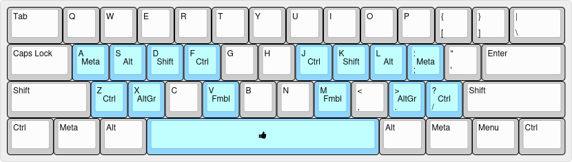

# Kenkyo

A layered layout designed to augment your ANSI keyboard's capabilities without modifying its standard behavior.

> Kenkyo (謙虚) is the Japanese term for humility or modesty.

**TL;DR;** Install one of the [supported keyboard customisation applications](#keyboard-customisation-software), place the corresponding configuration file we provide in the recommended location and use as follows:

- Hold `A`, `B`, `D`, `F` and `V` for `Meta` (Win/Command), `Shift`, `Control`, `Alt` and `AltGr` respectively.
- Hold `M`, `J`, `K`, `L` and `;` for `AltGr`, `Alt`, `Control`, `Shift` and `Meta` respectively.
- Hold `Caps-lock` to activate the extend (navigation/editing) layer.
- Hold the spacebar (anchor key) and immediately tap:
  - `Shift` to anchor the shift layer
  - `B` to anchor your custom (macros, shortcuts, etc.) layer
  - any other key to anchor the fumbol (function/number/symbol) layer

## Components:

- [Main layer](https://www.keyboard-layout-editor.com/##@_name=Main;&@_w:1.5;&=Tab&=Q&=W&=E&=R&=T&=Y&=U&=I&=O&=P&=%7B%0A%5B&=%7D%0A%5D&_w:1.5;&=%7C%0A%5C;&@_c=#90D5FF&w:1.75;&=Caps%20Lock%0A%0A%0A%0A%0A%0A%0A%0A%0AExtend&=A%0A%0A%0A%0A%0A%0A%0A%0A%0AMeta&=S%0A%0A%0A%0A%0A%0A%0A%0A%0AShift&=D%0A%0A%0A%0A%0A%0A%0A%0A%0ACtrl&=F%0A%0A%0A%0A%0A%0A%0A%0A%0AAlt&_c=#cccccc;&=G&=H&_c=#90D5FF;&=J%0A%0A%0A%0A%0A%0A%0A%0A%0AAlt&=K%0A%0A%0A%0A%0A%0A%0A%0A%0ACtrl&=L%0A%0A%0A%0A%0A%0A%0A%0A%0AShift&=/:%0A/;%0A%0A%0A%0A%0A%0A%0A%0AAlt&_c=#cccccc;&=%22%0A'&_w:2.25;&=Enter;&@_w:2.25;&=Shift&=Z&=X&=C&_c=#90D5FF;&=V%0A%0A%0A%0A%0A%0A%0A%0A%0AAltGr&_c=#cccccc;&=B&=N&_c=#90D5FF;&=M%0A%0A%0A%0A%0A%0A%0A%0A%0AAltGr&_c=#cccccc;&=%3C%0A,&=%3E%0A.&=?%0A//&_w:2.75;&=Shift;&@_w:1.25;&=Ctrl&_w:1.25;&=Meta&_w:1.25;&=Alt&_c=#90D5FF&a:7&w:6.25;&=Fumbol&_c=#cccccc&a:4&w:1.25;&=Alt&_w:1.25;&=Meta&_w:1.25;&=Menu&_w:1.25;&=Ctrl)
  
  
- [Extend layer](https://www.keyboard-layout-editor.com/##@_name=Extend;&@_w:1.5;&=Tab&_c=#90D5FF;&=Esc&=Meta&_c=#cccccc;&=E&=R&=T&_c=#90D5FF;&=PgUp&=Home&=%E2%86%91&=End&=Insert&_c=#cccccc;&=%7B%0A%5B&=%7D%0A%5D&_w:1.5;&=%7C%0A%5C;&@_c=#FFA500&w:1.75;&=Caps%20Lock&_c=#90D5FF;&=Shift&=Ctrl&=Alt&_c=#cccccc;&=F&=G&_c=#90D5FF;&=PgDn&=%E2%86%90&=%E2%86%93&=%E2%86%92&=Delete&_c=#cccccc;&=%22%0A'&_w:2.25;&=Enter;&@_w:2.25;&=Shift&=Z&=X&=C&=V&=B&_c=#90D5FF;&=Menu&=Bspc&=Spc&=Tab&=Enter&_c=#cccccc&w:2.75;&=Shift;&@_w:1.25;&=Ctrl&_w:1.25;&=Meta&_w:1.25;&=Alt&_a:7&w:6.25;&=&_a:4&w:1.25;&=Alt&_w:1.25;&=Meta&_w:1.25;&=Menu&_w:1.25;&=Ctrl)
  
  
- [Fumbol layer](https://www.keyboard-layout-editor.com/##@_name=Fumbol%3B&@_w:1.5%3B&=Tab&_c=%2390D5FF%3B&=F1&=F2&=F3&=F4&=F5&=F6&=F7&=F8&=F9&=F10&=F11&=F12&_w:1.5%3B&=F13%3B&@_w:1.75%3B&=Caps%20Lock%0A%0A%0A%0A%0A%0A%0A%0A%0AExtend&=!%0A1%0A%0A%0A%0A%0A%0A%0A%0AMeta&=%2F@%0A2%0A%0A%0A%0A%0A%0A%0A%0AShift&=%23%0A3%0A%0A%0A%0A%0A%0A%0A%0ACtrl&=$%0A4%0A%0A%0A%0A%0A%0A%0A%0AAlt&=%25%0A5&=%5E%0A6&=%2F&%0A7%0A%0A%0A%0A%0A%0A%0A%0AAlt&=*%0A8%0A%0A%0A%0A%0A%0A%0A%0ACtrl&=(%0A9%0A%0A%0A%0A%0A%0A%0A%0AShift&=)%0A0%0A%0A%0A%0A%0A%0A%0A%0AMeta&=%7C%0A%5C&_c=%23cccccc&w:2.25%3B&=Enter%3B&@_w:2.25%3B&=Shift&_c=%2390D5FF%3B&=Mute&=VolDn&=VolUp&=Play%0APause&=Cstm&=~%0A%60&=%2F_%0A-&=+%0A%2F=&=%7B%0A%5B&=%7D%0A%5D&_c=%23cccccc&w:2.75%3B&=Shift%3B&@_w:1.25%3B&=Ctrl&_w:1.25%3B&=Meta&_w:1.25%3B&=Alt&_c=%23FFA500&a:7&w:6.25%3B&=&_c=%23cccccc&a:4&w:1.25%3B&=Alt&_w:1.25%3B&=Meta&_w:1.25%3B&=Menu&_w:1.25%3B&=Ctrl) (function, number, symbol)
  
  
- [Custom (or personal) layer](https://www.keyboard-layout-editor.com/##@_name=Custom;&@_w:1.5;&=Tab&=Q&=W&=E&=R&=T&=Y&=U&=I&=O&=P&=%7B%0A%5B&=%7D%0A%5D&_w:1.5;&=%7C%0A%5C;&@_c=#90D5FF&w:1.75;&=Caps%20Lock%0A%0A%0A%0A%0A%0A%0A%0A%0AExtend&=F14%0A%0A%0A%0A%0A%0A%0A%0A%0AMeta&=F15%0A%0A%0A%0A%0A%0A%0A%0A%0AShift&=F16%0A%0A%0A%0A%0A%0A%0A%0A%0ACtrl&=F17%0A%0A%0A%0A%0A%0A%0A%0A%0AAlt&=F18&=F19&=F20%0A%0A%0A%0A%0A%0A%0A%0A%0AAlt&=F21%0A%0A%0A%0A%0A%0A%0A%0A%0ACtrl&=F22%0A%0A%0A%0A%0A%0A%0A%0A%0AShift&=F23%0A%0A%0A%0A%0A%0A%0A%0A%0AMeta&=F24&_c=#cccccc&w:2.25;&=Enter;&@_w:2.25;&=Shift&=Z&=X&=C&=V&=B&=N&=M&=%3C%0A,&=%3E%0A.&=?%0A//&_w:2.75;&=Shift;&@_w:1.25;&=Ctrl&_w:1.25;&=Meta&_w:1.25;&=Alt&_c=#FFA500&a:7&w:6.25;&=&_c=#cccccc&a:4&w:1.25;&=Alt&_w:1.25;&=Meta&_w:1.25;&=Menu&_w:1.25;&=Ctrl)
  
  

## Goal

In this repository I intend to share configuration files for a range of free and open-source keyboard customisation applications which implement a layered keyboard layout I developed, following a series of principles, aiming at providing a starting point for those seeking to increase their productivity and/or improve the ergonomy of their
workflows without having to spend too much money on expensive hardware, or too much time doing research, in order to experience the benefits of keyboard customisation.

## Principles

- Seamlessness: A user that is unaware or the presence of this layout should not be able to tell it is there. 
- Progressiveness: A new user of the layout should be able to adopt the layout gradually and always have the option to fall-back to pre-existing habits if necessary.
- Composability: The layout should be built on well known patterns that can be applied together or individually.
- Efficiency: The layout should endeavour to strike a balance between the effort required for its use (i.e. hand motion) and that required to learn it (i.e., complexity).

## Patterns

- [Home row modifiers](https://precondition.github.io/home-row-mods)
- [Impermanent (momentary) layers](https://jonny-wamsley.gitbook.io/the-ultimate-guide-to-keyboard-layers/ch-3-layer-activators/3.3-shift-layers)
- [Layer anchoring](https://argenkiwi.medium.com/keyboard-layer-pinning-20aafede96e5)
 
## Keyboard customisation software

- [Kanata](https://github.com/jtroo/kanata)
- [Keyd](https://github.com/rvaiya/keyd)
